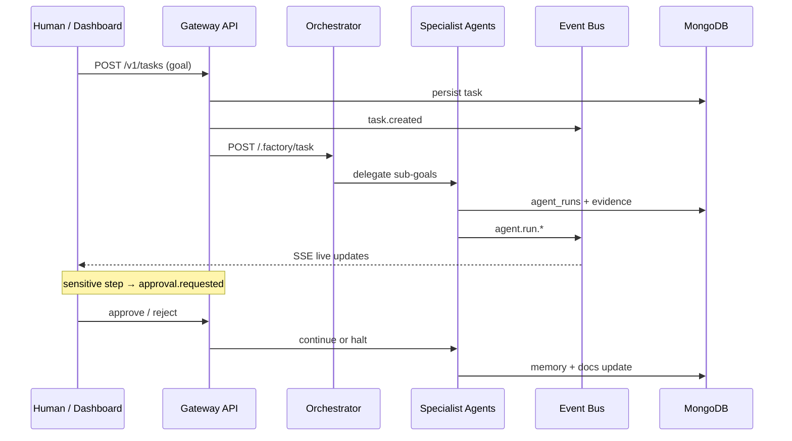

# Autonomous OS Kernel

**The agentic autonomous operating system kernel** — production infrastructure to build, run, monitor, repair, and evolve a multi-agent AI factory with humans firmly in the control loop.

> This is **not** an MVP or a demo. It is the long-term foundation of an **operational intelligence platform**: observable, approvable, independently deployable, and designed for phased growth.

| | |
|---|---|
| **Services** | 19 independent services · one Dokploy app each |
| **Operator tools** | 50+ live tools across 15+ categories |
| **Development phase** | Phase AG.2 complete (Living Command Universe, Realtime Operator Runtime, Dedicated Domain Rooms, Real Research Fabric, Jarvis Research Wiring & Local Reachability Fix) |
| **Runtime** | Node.js 22+ · pnpm 9 · TypeScript 5.9 |
| **Data** | MongoDB Atlas · AWS S3 · SSE Event Bus |

---

## Table of contents

- [Why this system?](#why-this-system)
- [Key capabilities](#key-capabilities)
- [Architecture](#architecture)
- [Technology stack](#technology-stack)
- [Service catalog](#service-catalog)
- [Execution flow](#execution-flow)
- [Operator Runtime](#operator-runtime)
- [Workspace Evolution](#workspace-evolution)
- [Governance & security](#governance--security)
- [Monorepo layout](#monorepo-layout)
- [Quick start](#quick-start)
- [Documentation](#documentation)
- [Status](#status)

---

## Why this system?

Most “AI agent” projects are a chatbot or a script. **Autonomous OS Kernel** is a **factory operating system** that:

- Turns human goals into **tasks, plans, execution, and evidence**
- Distributes work across **19 specialist services**, not a single monolithic process
- Routes every sensitive action through **human approval, RBAC, and Safe Mode**
- Records outcomes in **memory, learning pipelines, and living documentation**
- **Generates, validates, activates, and repairs** new services when needed
- Is commanded through the **Operator Console** and **Voice Operator**

Core design: **independent deployment + shared contracts + HTTP communication** — no runtime coupling between containers.

---

## Key capabilities

### Multi-agent intelligence
- **Orchestrator** decomposes goals and delegates to specialist agents
- **Architect / Builder / DevOps / Memory / Documentation** — each with a clear mandate
- **Reviewer / QA / Report / Monitor** — quality, observability, and reporting layer
- **Internet Research** — web research with traceable evidence

### Autonomous development engine
- **Capability Graph** — gap detection and expansion proposals
- **Service Generator** — scaffold new services from the factory template
- **Runtime Validation** — real build, health, manifest, and smoke checks
- **GitHub Delivery** — branches, commits, and PRs behind approval
- **Live Activation** — Dokploy activation only after live verification

### Autonomous repair & operations
- **Monitor Agent** — health scans, incidents, and repair tasks
- **Repair Loop** — diagnose → plan → safe execution → learning
- **Safe Operations** — deploy, rollback, and Dokploy ops with plans + evidence
- **Strategic Planner** — multiple plans, 10-dimensional scoring, policy-driven selection

### Operator Runtime (Jarvis-class)
- **50+ live tools** — inspect, deploy, code, test, git, learning, and more
- Loop: **plan → tool → observe → approve → continue → evidence → memory**
- **Operator Console** — serious UI with runtime panel, inline approvals, live narration
- **Voice Operator** — WebRTC realtime + STT/TTS + anti-mistake guardrails

### Living Command Universe (Phase AC+, AF.1–AF.4.4)
- **`/` home** — a persistent, realtime personal command surface, not a static dashboard
- **9 domain zones**, each with a real domain-specific visual (body map, cashflow, venture board, opportunity radar, …) driven by `/v1/me/universe`
- **Domain action layer** — accept/reject/ingest controls directly on zone cards, not read-only
- **Persistent live-state** (`/v1/operator/live-state`) — active operations, approvals, and the Live Activity feed survive refresh and navigation, one card per real operation

### Workspace Evolution (Phase Y)
- **Isolated, disposable** workspace under `.workspaces/`
- Service copy, deep multi-file edits, real typecheck/build
- **15 verification checks** + check-fix loop with no fabricated success
- **Migration Plan** — promote to `services/` only with approval; rollback without losing the previous version

### Learning & governance
- Learning from 15+ historical collections · reliability scores · pattern mining
- **RBAC** (owner / operator / viewer / agent) · audit logs · policy engine
- **Outcome Learning** · scoring profiles · evidence-backed recommendations
- Memory compression · prompt performance · improvement workflows

---

## Architecture

```
                    ┌─────────────────────────────────────────┐
  Human ──────────► │  dashboard-web  (factory.simorx.com)     │
                    │  Next.js 16 · Operator Console · Voice   │
                    └──────────────────┬──────────────────────┘
                                       │ admin token (server-side)
                                       ▼
                    ┌─────────────────────────────────────────┐
                    │  gateway-api  (api.simorx.com)           │
                    │  API · tasks · approvals · operator/voice│
                    └──┬────────────┬────────────┬────────────┘
         internal token│            │            │
              ┌────────▼──┐  ┌──────▼──────┐  ┌▼──────────────┐
              │orchestrator│  │ 19 agents & │  │service-registry │
              │   -agent   │──│  services   │  │  (discovery)    │
              └─────┬──────┘  └──────┬──────┘  └─────────────────┘
                    │                │
                    │    ┌───────────▼───────────┐
                    └───►│ event-bus-service (SSE) │
                         └───────────┬───────────┘
                                     ▼
                              live dashboard

  code-operator-agent ──► CODE_WORKSPACE_ROOT (isolated git checkout)
  voice-operator-agent ─► OpenAI Realtime (ephemeral token)

  State: MongoDB Atlas (70+ collections)  |  Objects: AWS S3  |  Deploy: Dokploy
```

### Architecture principles

| Principle | Description |
|-----------|-------------|
| **One service = one app** | Each service has its own subdomain, port, env, and lifecycle |
| **HTTP + internal token** | Runtime communication over the network; `@factory/shared` is build-time only |
| **Factory endpoints** | Every service exposes `/health` · `/.factory/manifest` · `/.factory/task` · … |
| **Event-driven UI** | All changes stream from the event bus to the dashboard |
| **Human-in-the-loop** | mutate / deploy / promote / protected-core → approval required |
| **No fake success** | Unavailable tools return explicit `not_configured` — never pretend |

Details: [`docs/architecture.md`](docs/architecture.md)

---

## Technology stack

| Layer | Technology |
|-------|------------|
| **Language** | TypeScript 5.9 (strict) |
| **Frontend** | Next.js 16 · React 19 |
| **Backend** | Fastify 5 · Node.js 22+ |
| **Validation** | Zod 4 |
| **Database** | MongoDB Atlas |
| **Object storage** | AWS S3 + CloudFront |
| **Realtime** | SSE (Event Bus) · OpenAI Realtime WebRTC |
| **UI testing** | Playwright (browser-testing-agent) |
| **LLM** | OpenAI + Anthropic via LLM Router |
| **Git / CI** | GitHub API · branches · PRs |
| **Deploy** | Dokploy (Nixpacks) — no Docker required for local dev |
| **Monorepo** | pnpm workspaces |
| **Logging** | Pino |

---

## Service catalog

Every service has a stable port and subdomain in [`shared/src/constants`](shared/src/constants/index.ts).

### Control plane & gateway

| Service | Port | Subdomain | Role |
|---------|------|-----------|------|
| `dashboard-web` | 4100 | factory.simorx.com | Dashboard · Operator Console · Voice Dock |
| `gateway-api` | 4101 | api.simorx.com | Public API · tasks · approvals · operator/voice proxy |

### Core agents

| Service | Port | Subdomain | Role |
|---------|------|-----------|------|
| `orchestrator-agent` | 4102 | orchestrator.simorx.com | Goal decomposition · agent coordination |
| `architect-agent` | 4103 | architect.simorx.com | System and service architecture |
| `builder-agent` | 4104 | builder.simorx.com | Code generation and modification |
| `devops-agent` | 4105 | devops.simorx.com | Dokploy · infra · deploy |
| `memory-agent` | 4109 | memory.simorx.com | Memory · skill extraction |
| `monitor-agent` | 4113 | monitor.simorx.com | Health scan · incidents · repair |
| `reviewer-agent` | 4106 | reviewer.simorx.com | Code and design review |
| `qa-agent` | 4107 | qa.simorx.com | Testing and quality |
| `report-agent` | 4114 | reports.simorx.com | Operational intelligence reports |
| `browser-testing-agent` | 4116 | browser-testing.simorx.com | Playwright · screenshots · evidence |

### Operator & voice

| Service | Port | Subdomain | Role |
|---------|------|-----------|------|
| `voice-operator-agent` | 4121 | voice.simorx.com | Realtime voice · ephemeral token · tool mediation |
| `code-operator-agent` | 4122 | code.simorx.com | inspect/search/edit/typecheck/git/PR · workspace runtime |

### Infrastructure

| Service | Port | Subdomain | Role |
|---------|------|-----------|------|
| `service-registry` | 4108 | registry.simorx.com | Service registration and discovery |
| `event-bus-service` | 4111 | events.simorx.com | Persist events · SSE fan-out |
| `file-asset-service` | 4112 | assets.simorx.com | Files and artifacts in S3 |
| `documentation-service` | 4110 | docs.simorx.com | Living documentation |
| `internet-research-service` | 4115 | research.simorx.com | Web research |

Full map: [`docs/service-map.md`](docs/service-map.md) · agents: [`docs/agent-map.md`](docs/agent-map.md)

---

## Execution flow

From a human goal to an auditable outcome:



1. **Goal intake** — dashboard or API persists a task in MongoDB  
2. **Planning** — orchestrator breaks the goal into sub-tasks  
3. **Execution** — specialist agents run work and record `agent_runs`  
4. **Live events** — event bus streams every step to the UI  
5. **Approval** — sensitive actions create `approvals`; the human decides  
6. **Learning** — memory agent summarizes; documentation service updates  

---

## Operator Runtime

High-level command layer — real tool execution instead of “chat only”:

| Category | Example tools |
|----------|---------------|
| Inspect | system status · readiness · service registry · events |
| Deploy / Ops | health check · Dokploy deploy · rollback · safe mode |
| Code | inspect repo · search · propose patch · edit (isolated branch) |
| Test & Build | typecheck · build package · smoke tests |
| Git | create branch · commit · open PR |
| Workspace | create · copy · generate service · verify · promote |
| Learning | analyze history · research · recommendations |

- **Protected Core** — `gateway-api`, `dashboard-web`, `shared/src/` cannot be edited without owner approval  
- **Code Workspace** — `CODE_WORKSPACE_ROOT` must point at a dedicated git checkout  
- **Capability Answer** — “what can you do?” is answered from the live registry, not a static prompt  

---

## Workspace Evolution

Phase Y provides a **temporary, isolated** workspace for evolving services:

```
services/dashboard-web/          ← production (untouched)
        │
        ▼ copy (rsync)
.workspaces/<id>/dashboard-web-evolved/   ← edit · typecheck · build · verify
        │
        ▼ promote (with approval)
services/dashboard-web/          ← only after migration plan + owner approval
```

- Max iterations · time · file count — configurable via env  
- **15 verification checks** — health, manifest, status, token guard  
- **Rollback** — previous version preserved; promote branch kept for inspection  
- `.workspaces/` is in `.gitignore` — fully disposable  

---

## Governance & security

| Mechanism | Purpose |
|-----------|---------|
| **RBAC** | owner · operator · viewer · agent |
| **Approval Center** | Gate for mutate · deploy · promote · PR |
| **Safe Mode** | Halt dangerous operations in critical conditions |
| **Policy Engine** | allowed · blocked · approval_required |
| **Audit Logs** | Record every governance decision |
| **Internal Token** | Service-to-service authentication |
| **Session Auth** | Dashboard login with scrypt + signed cookie |
| **Rate Limiting** | Protect sensitive endpoints |
| **Evidence Store** | Every claim backed by a traceable record |

---

## Monorepo layout

```
autonomous-os-kernel/
├── shared/                    @factory/shared
│   └── contracts · schemas · constants · db · storage · operator · workspace
├── packages/
│   └── service-kit/           @factory/service-kit — Fastify factory bootstrap
├── services/                  19 services — one Dokploy app each
│   ├── gateway-api/
│   ├── dashboard-web/
│   ├── orchestrator-agent/
│   ├── code-operator-agent/
│   ├── voice-operator-agent/
│   └── …
├── templates/                 scaffolds for new services
├── deployment/                Dokploy specs + env
├── docs/                      architecture · roadmap · phase-log · decision-log
└── scripts/                   dev:all · sync:env · smoke tests
```

**Shared packages**

| Package | Role |
|---------|------|
| `@factory/shared` | Contracts, Zod schemas, constants, MongoDB, S3, operator registry |
| `@factory/service-kit` | Uniform Fastify bootstrap: health, manifest, task, registry, events |

---

## Quick start

### Prerequisites

- Node.js **22+**
- pnpm **9+** (`corepack enable`)
- MongoDB Atlas URI
- AWS S3 credentials (for file-asset-service)
- Copy env: `cp .env.example .env` and fill in values

### Full local run

```bash
corepack enable
pnpm install
pnpm dev:all
```

`dev:all` runs: `sync:env` → `build:deps` → **14 services** concurrently (including `code-operator-agent`)

| URL | Service |
|-----|---------|
| http://localhost:4100 | Dashboard |
| http://localhost:4101 | Gateway API |
| http://localhost:4122 | Code Operator Agent |

```bash
# Gateway health
curl http://localhost:4101/health

# Registered services
curl http://localhost:4101/v1/services
```

### Single service

```bash
pnpm run build:deps
pnpm --filter @factory/gateway-api run dev
```

### Critical Operator env vars

```env
# In root .env — synced to code-operator-agent via sync:env
CODE_WORKSPACE_ROOT="/path/to/your/git/checkout"
GITHUB_TOKEN=...          # optional — for commit/PR
GITHUB_OWNER=...
GITHUB_REPO=autonomous-os-kernel
```

Full deploy and env guide: [`README-SETUP.md`](README-SETUP.md)

---

## Documentation

| Document | Topic |
|----------|-------|
| [`docs/architecture.md`](docs/architecture.md) | System shape and data flow |
| [`docs/service-map.md`](docs/service-map.md) | Service map |
| [`docs/agent-map.md`](docs/agent-map.md) | Agent map |
| [`docs/data-model.md`](docs/data-model.md) | MongoDB collections |
| [`docs/service-communication-protocol.md`](docs/service-communication-protocol.md) | Communication protocol |
| [`docs/decision-log.md`](docs/decision-log.md) | Architecture decisions |
| [`docs/roadmap.md`](docs/roadmap.md) | Roadmap |
| [`docs/phase-log.md`](docs/phase-log.md) | Phase-by-phase delivery log |

---

## Status

| Phase | Topic | Status |
|-------|-------|--------|
| 1–5 | Foundation · Autonomous Loop · Capability Engine · Reality · Activation | ✅ |
| 6–9 | Repair · Strategic Reasoning · Governance · Operational Learning | ✅ |
| 10–17 | Continuous Improvement · Security · Intelligence · Safe Ops · Dokploy | ✅ |
| 18–19 | Voice Operator · WebRTC Realtime | ✅ |
| X | Operator Runtime · 50+ tools · Operator Console | ✅ |
| Y–Z | Workspace Evolution · isolated staging · live fix loop | ✅ |
| AA–AB | Scope/Identity/Multi-Tenant Governance · Personal Reality Baseline & Jarvis Intelligence | ✅ |
| AC+ | Living AI Government Interface — 9-zone Jarvis Command Universe home | ✅ |
| AD–AE.1 | Jarvis Intelligence Core · Memory/Daily Brain · Priority & Memory Correction | ✅ |
| AF.1–AF.4.4 | Domain Canvas (9 real renderers) · domain actions · realtime block runtime · persistent live-state · grouped Live Activity feed | ✅ |
| AF.5 | Dedicated per-domain rooms (`/health` … `/presence`) — every zone's "Open" link leads somewhere real | ✅ |
| AG | Real Research & Intelligence Fabric — real web search (Tavily) grounds `internet-research-service`, honest `sourceMode` tracking | ✅ |
| AG.1 | Research Fabric Wired Into Jarvis/Operator — `find_opportunities`/`research_topic` now dispatch real synchronous research instead of a stale hardcoded string / fire-and-forget task | ✅ |
| AG.2 | internet-research-service Reachability — service was missing from the local dev catalog (`pnpm dev:all`/`sync:env` never started it); added, plus honest `service_unreachable`/`service_error`/`provider_not_configured` error classification | ✅ |

**Latest verification (Phase AG.2, 2026-07-09):** 21/21 new smoke
(`phaseag2-research-reachability-smoke.mjs`) · prior suites unchanged (183/183 Phase AG total) ·
`shared`/`gateway-api`/`internet-research-service` `tsc`/`tsc --noEmit` clean · `next build` still
unverified in this sandbox (missing `@next/swc-linux-arm64` binary — see `docs/decision-log.md`
D-124). Live end-to-end reachability against a real running service was not exercised in this
sandbox (no persistent processes here) — see the manual verification commands in
`docs/phase-log.md`'s Phase AG.2 entry. Full phase-by-phase detail: `docs/phase-log.md`.

Per-phase details: [`docs/phase-log.md`](docs/phase-log.md)

---

<p align="center">
  <strong>Autonomous OS Kernel</strong> — think · plan · execute · monitor · learn · evolve<br>
  <sub>Built for long-term autonomous intelligence infrastructure · Human always in control</sub>
</p>
