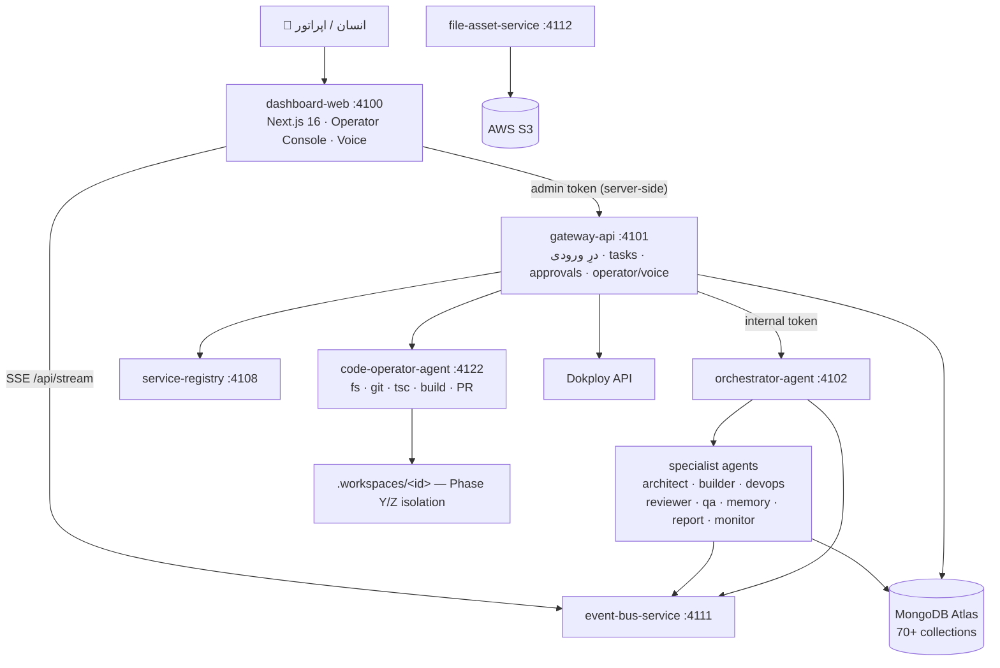

# گزارش فنی جامع — Autonomous OS Kernel

> بررسی تخصصی و مبتنی بر شواهدِ کد از کل پروژه، مخزن، سرویس‌ها و قابلیت‌ها.
> تاریخ گزارش: ۱۴۰۵/۰۴/۱۴ (Jul 5, 2026) · وضعیت مخزن: تا Phase Z
> این گزارش بر پایه‌ی مطالعه‌ی مستقیم کد (نه صرفاً README) تهیه شده است و «ادعا» را از «واقعیت پیاده‌سازی» تفکیک می‌کند.

> **یادداشت وضعیت (۲۰۲۶-۰۷-۰۹ / 2026-07-09):** این گزارش پیش از فازهای AA تا
> AF.4.4 نوشته شده و آن‌ها را پوشش نمی‌دهد — از جمله Scope/Identity Governance،
> Personal Reality Baseline، Jarvis Intelligence Core/Memory، و کل صفحه‌ی
> خانه‌ی Living Command Universe (۹ ناحیه با رندرر اختصاصی، لایه‌ی اقدام
> دامنه، live-state پایدار). **بخش ۱۱ ("فقدانِ کاربردِ نهایی")** به‌طور
> مشخص توسط همین فازها هدف قرار گرفت. برای وضعیت فعلی به `docs/phase-log.md`
> (فاز AC+ تا AF.4.4) و `docs/living-command-universe-vision.md` مراجعه کنید.
> This report predates Phases AA–AF.4.4 and does not cover them — including
> the Living Command Universe home, Jarvis intelligence/memory, and the
> Section 11 "no end product" gap this exact work addressed. See
> `docs/phase-log.md` and `docs/living-command-universe-vision.md` for current state.

---

## فهرست

1. [خلاصه‌ی مدیریتی](#۱-خلاصهی-مدیریتی)
2. [هویت و ماهیت پروژه](#۲-هویت-و-ماهیت-پروژه)
3. [معماری فنی](#۳-معماری-فنی)
4. [پشته‌ی فناوری](#۴-پشتهی-فناوری)
5. [کاتالوگ سرویس‌ها و عمق واقعی کد](#۵-کاتالوگ-سرویسها-و-عمق-واقعی-کد)
6. [ورودی‌ها و خروجی‌ها](#۶-ورودیها-و-خروجیها-inputs--outputs)
7. [مدل داده و وضعیت پایدار](#۷-مدل-داده-و-وضعیت-پایدار)
8. [حاکمیت، امنیت و کنترل انسانی](#۸-حاکمیت-امنیت-و-کنترل-انسانی)
9. [ماتریس واقعیت یکپارچه‌سازی‌های خارجی](#۹-ماتریس-واقعیت-یکپارچهسازیهای-خارجی)
10. [امروز با این سیستم چه کاری می‌توان کرد؟](#۱۰-امروز-با-این-سیستم-چه-کاری-میتوان-کرد)
11. [ممیزی فنی: نقاط قوت، ضعف و ریسک‌ها](#۱۱-ممیزی-فنی-نقاط-قوت-ضعف-و-ریسکها)
12. [برای عملیاتی‌تر شدن چه باید کرد؟](#۱۲-برای-عملیاتیتر-شدن-چه-باید-کرد-نقشه-راه-اولویتبندیشده)
13. [این پروژه به چه چیزی می‌تواند تبدیل شود؟](#۱۳-این-پروژه-به-چه-چیزی-میتواند-تبدیل-شود)
14. [پیوست: اعداد کلیدی](#۱۴-پیوست-اعداد-کلیدی)

---

## ۱. خلاصه‌ی مدیریتی

**Autonomous OS Kernel** یک **سیستم‌عاملِ کارخانه‌ی چندعاملی (multi-agent factory OS)** است: زیرساختی برای ساختن، اجرا، پایش، ترمیم و تکاملِ خودکارِ نرم‌افزار، با انسان در حلقه‌ی کنترل. برخلاف اکثر پروژه‌های «AI agent» که یک اسکریپت یا چت‌بات هستند، این پروژه یک **مونوریپوی صنعتیِ چند سرویسی** با مرزبندی قوی، قراردادهای مشترک، و قابلیت مشاهده‌پذیری کامل است.

**یافته‌های کلیدی:**

- **معماری واقعی و پخته است.** ۱۹ سرویس مستقل، یک لایه‌ی مشترک قوی (`@factory/shared`، ~۷٬۸۰۰ خط)، و یک بوت‌استرپ یکنواخت (`@factory/service-kit`). ارتباطات صرفاً HTTP + توکن داخلی است؛ هیچ اتصالِ runtime بین کانتینرها وجود ندارد.
- **فلسفه‌ی «بدون موفقیت جعلی» به‌طور جدی رعایت شده است.** هرجا کلید/API تنظیم نباشد، مسیر `not_configured` / `manual_required` / `fallback` فعال می‌شود و سیستم هرگز وانمود به موفقیت نمی‌کند. این یک تمایز مهندسیِ ارزشمند است.
- **بخش زیادی از «هوش» در واقع deterministic fallback است.** بدون کلید LLM، عامل‌ها با خروجی‌های ساختاریافته‌ی از پیش تعریف‌شده کار می‌کنند (schema-validated). این خوب است برای پایداری، اما یعنی «هوش واقعی» مشروط به کلیدهای API است.
- **دو نقطه‌ی قوتِ متمایز:** (۱) **Operator Runtime** با ۶۸ ابزارِ واقعی و حلقه‌ی `plan → tool → observe → approve`؛ (۲) **Workspace Evolution (Phase Y/Z)** که سرویس‌ها را در محیط ایزوله کپی/ویرایش/بیلد/تأیید و سپس با تأیید انسانی promote می‌کند.
- **شکاف اصلی:** پروژه یک **پلتفرم بی‌نظیرِ زیرساختی** است اما هنوز **یک «کاربردِ نهاییِ» مشخص برای کاربرِ بیرونی ندارد**. همه‌چیز حول «کارخانه‌ای که خودش را می‌سازد» می‌چرخد (خودارجاعی)؛ برای عملیاتی شدن باید یک دامنه‌ی کاربردی واقعی به آن وصل شود.

---

## ۲. هویت و ماهیت پروژه

طبق `docs/vision.md`، هدف نهایی ساختِ «هسته‌ی یک سیستم‌عاملِ خودگردانِ آینده» است: کارخانه‌ای که «فکر می‌کند، برنامه می‌ریزد، اجرا می‌کند، پایش می‌کند، گزارش می‌دهد و بهبود می‌یابد» و در نهایت به «توسعه‌ی دیجیتالِ تصمیم‌گیریِ مالک» تبدیل شود.

**اصول غیرقابل‌مذاکره (از کد و مستندات قابل تأیید):**

| اصل | وضعیت پیاده‌سازی |
|-----|------------------|
| Production-grade، ماژولار، قابل‌مشاهده | ✅ رعایت شده (TypeScript strict، Pino، رویدادمحور) |
| سرویس‌های مستقل با مرز و قرارداد قوی | ✅ هر سرویس یک اپ Dokploy مستقل |
| مستندسازی و حافظه به‌عنوان شهروند درجه‌یک | ✅ `documentation-service` + `memory-agent` + docs غنی |
| تأیید انسانی برای اقدامات حساس | ✅ Approval Center + RBAC + Safe Mode |
| فناوری‌های پایدارِ روز | ✅ Next.js 16، Fastify 5، Node 22، Zod 4 |

**نکته‌ی مهم درباره‌ی وضعیت فعلی:** فازبندیِ پروژه (۱ تا Z) نشان می‌دهد این یک تلاشِ توسعه‌ای بلندمدت و منظم بوده است. اما جهت‌گیریِ همه‌ی فازها **درون‌گرا** است — یعنی کارخانه‌ای که ابزارهای ساختِ کارخانه را می‌سازد. `CODE_WORKSPACE_ROOT` در `.env` به خودِ همین مخزن اشاره می‌کند؛ یعنی سیستم در حال حاضر عمدتاً روی **خودش** کار می‌کند (self-development engine).

---

## ۳. معماری فنی

### شکل کلی

### اصول معماری (قابل تأیید در کد)

1. **یک سرویس = یک اپ.** هر سرویس ساب‌دامین، پورت، env و چرخه‌ی حیات مستقل دارد (`shared/src/constants/index.ts`).
2. **ارتباط فقط HTTP + توکن داخلی.** `@factory/shared` صرفاً وابستگیِ build-time است؛ در runtime هیچ سرویسی به کدِ سرویس دیگر وابسته نیست (`PeerClient`).
3. **سطح یکنواختِ سرویس.** هر سرویس این‌ها را دارد: `/health`, `/.factory/manifest`, `/.factory/status`, `/.factory/capabilities`, `/.factory/task`, `/.factory/logs` — همه از `service-kit` (`packages/service-kit/src/index.ts`).
4. **رویدادمحور.** هر تغییر یک event به `event-bus-service` می‌فرستد که با SSE به داشبورد پخش می‌شود.
5. **انسان در حلقه.** mutate / deploy / promote / protected-core همگی نیازمند تأیید هستند.
6. **بدون موفقیتِ جعلی.** ابزارهای فاقد پیکربندی `available:false` با دلیل صریح ثبت می‌شوند.

### الگوی امنیتی توکن (از `service-kit`)

- `/health` و متادیتای غیرمحرمانه (`manifest/status/capabilities`) **عمومی** — تا probeهای workspace و registry بدون توکن بخوانند.
- `/.factory/task` و `/.factory/logs` **پشتِ توکن داخلی**.
- داشبورد با `x-factory-admin-token` + `x-factory-role` (از session امضا‌شده) با gateway حرف می‌زند؛ کلاینتِ نامعتبر نمی‌تواند نقش خود را ارتقا دهد.

---

## ۴. پشته‌ی فناوری

| لایه | فناوری | ارزیابی |
|------|--------|---------|
| زبان | TypeScript 5.9 (strict) | روزآمد |
| فرانت‌اند | Next.js 16 · React 19 | روزآمد (App Router + Server Actions) |
| بک‌اند | Fastify 5 · Node.js 22+ | روزآمد و سبک |
| اعتبارسنجی | Zod 4 | قرارداد-محور در همه‌جا |
| پایگاه‌داده | MongoDB Atlas (driver رسمی) | واقعی |
| ذخیره‌ی شیء | AWS S3 (`@aws-sdk/client-s3`) + CloudFront | واقعی |
| Realtime | SSE (Event Bus) · OpenAI Realtime WebRTC | واقعی |
| تست UI | Playwright (با fallback به fetch) | واقعی/مشروط |
| LLM | OpenAI + Anthropic از طریق LLM Router | واقعی (با MockProvider fallback) |
| Git/CI | GitHub REST API (بدون Octokit، fetch مستقیم) | واقعی |
| Deploy | Dokploy (Nixpacks) — بدون Docker برای dev محلی | واقعی |
| مونوریپو | pnpm workspaces | استاندارد |
| لاگ | Pino | استاندارد |

**نکته‌ی مثبت:** انتخاب‌های فناوری همگی پایدار، سبک و روزآمدند؛ هیچ وابستگیِ آزمایشی یا رهاشده‌ای دیده نشد.

---

## ۵. کاتالوگ سرویس‌ها و عمق واقعی کد

توزیع خطوطِ کد نشان می‌دهد بیشترِ منطق در `shared` و چند سرویسِ هسته‌ای متمرکز است و بقیه‌ی عامل‌ها **نازک (thin)** هستند و به `shared` + LLM Router تکیه دارند.

| سرویس | پورت | خطوط کد | کارِ واقعی | وابسته‌ی fallback |
|-------|------|---------|-----------|-------------------|
| `gateway-api` | 4101 | **۲٬۳۳۵** | درِ ورودیِ کامل، ~۶۰ endpoint، executor همه‌ی ابزارها، Dokploy/voice proxy | — |
| `orchestrator-agent` | 4102 | **۱٬۵۲۰** | seed capabilities/governance، pipeline delegation، approval gate | LLM اختیاری |
| `dashboard-web` | 4100 | **۶٬۹۱۶** (۱۲۵ فایل) | ۸۸ صفحه، Operator Console، Voice، auth | — |
| `code-operator-agent` | 4122 | **۸۳۰** | fs/grep/git/tsc/build/PR + Phase Y runtime (rsync/spawn/probe) | `not_configured` بدون env |
| `monitor-agent` | 4113 | ۵۲۳ | probe واقعیِ HTTP، incident، repair loop | diagnose/plan قطعی |
| `devops-agent` | 4105 | ۲۰۰ | infra request، GitHub deliver | Dokploy فقط spec، GitHub prepared |
| `browser-testing-agent` | 4116 | ۱۹۵ | Playwright واقعی | HTTP fetch |
| `documentation-service` | 4110 | ۱۸۷ | living docs در Mongo | — |
| `memory-agent` | 4109 | ۱۶۷ | خلاصه + skill upsert | **بدون LLM** (کاملاً قالبی) |
| `file-asset-service` | 4112 | ۱۶۰ | presign S3، metadata | — |
| `voice-operator-agent` | 4121 | ۱۳۵ | mint توکن OpenAI Realtime | «not configured» |
| `service-registry` | 4108 | ۱۲۳ | register/discovery | — |
| `architect-agent` | 4103 | ۱۰۱ | improvement_plan با LLM | design JSON قطعی |
| `internet-research-service` | 4115 | ۸۲ | تحقیق با LLM | **بدون search API واقعی** |
| `event-bus-service` | 4111 | ۱۴۰ | persist + SSE fan-out | — |
| `builder-agent` | 4104 | ۱۵۷ | scaffold فایل واقعی | default فقط acknowledgement |
| `qa-agent` | 4107 | ۷۱ | QA با LLM + شواهد | criteria قطعی |
| `report-agent` | 4114 | ۷۰ | گزارش executive با LLM | deterministicReport |
| `reviewer-agent` | 4106 | ۷۰ | review با LLM | checklist قطعی |

**جمع‌بندی این بخش:** «۱۹ سرویس» یک ادعای درست است، اما ساختارِ واقعی این‌طور است که **مغزِ اصلی در `gateway-api` + `orchestrator` + `shared` + `code-operator-agent`** قرار دارد و بسیاری از agentها لایه‌های نازکِ تخصص‌گرا روی زیرساختِ مشترک‌اند. این از نظر معماری منطقی است (single source of truth در `shared`).

---

## ۶. ورودی‌ها و خروجی‌ها (Inputs / Outputs)

### ۶.۱ ورودی‌های انسانی

| نوع ورودی | مسیر | محتوا |
|-----------|------|-------|
| ورود | `/login` | email + password (scrypt hash یا demo محلی) |
| هدف (task) | `/`, `/tasks`, `/start/actions` | متنِ goal یا template |
| هدف (operation) | `/` (OperationCommand) | goal + نوع عملیات (health_check/new_app/update/repair/restart/env_update) |
| فرمان اپراتور | Operator Console (روی همه‌ی صفحات) | متن یا صدا |
| فرمان صوتی | Operator Console | WebRTC realtime یا Web Speech API مرورگر |
| تأییدها | `/approvals`، کنسول‌ها | Approve / Reject |
| زیرساخت | `/infrastructure` | تأیید spec |
| deploy | `/deployment/checklists` | تأیید checklist + activation + baseUrl |
| repair | `/incidents/[id]` | تأیید plan، revalidate |
| گسترش | `/expansion-proposals` | approve/reject/request changes |
| حاکمیت | صفحات scoring/policy/recommendation | تأیید proposalها |
| امنیت | `/security`، `/security/safe-mode` | اجرای security check، toggle safe mode (فقط owner) |
| Dokploy | DokployCalibration | diagnostics، sync |
| یادگیری | `/learning/schedules` | trigger دستیِ learning run |

### ۶.۲ سطح API دروازه (نمونه‌ای از ~۶۰ endpoint)

**Command / mutating:**
`POST /v1/tasks` · `POST /v1/security/check` · `POST /v1/dokploy/sync` · `POST /v1/dokploy/diagnostics` · `POST /v1/voice/realtime-token` · `POST /v1/operator/command` · `POST /v1/operator/permissions/:id/decision` · endpointهای operation lifecycle (create→target→decision→executed→rollback).

**Query / read (نمونه):**
`GET /v1/tasks` · `/v1/services` · `/v1/approvals` · `/v1/capabilities` · `/v1/gaps` · `/v1/validations` · `/v1/activations` · `/v1/incidents` · `/v1/repair-*` · `/v1/reasoning` · `/v1/scoring-profiles` · `/v1/policy-*` · `/v1/audit-logs` · `/v1/rbac` · `/v1/learning-*` · `/v1/reliability` · `/v1/patterns` · `/v1/system-recommendations` · `/v1/llm/{status,costs,prompts,budget-events}` · `/v1/voice/{sessions,memories,tool-calls}` · `/v1/operator/{tools,capabilities,sessions,memories}` · `/v1/system/{status,integrations}`.

### ۶.۳ خروجی‌های انسانی

| خروجی | کجا دیده می‌شود |
|-------|-----------------|
| رویدادهای زنده | `/`، `/events` (SSE) |
| task + timeline انسانی‌خوان | `/tasks/[id]` |
| گزارش‌ها | `/reports`, `/reports/center`, `/research/[id]` |
| صف تأیید | `/`، `/approvals` |
| شواهد (evidence) | `/evidence`, `/evidence/explorer` |
| وضعیت operation | کنسول Overview (steps، verification، دستور دستی) |
| runtime اپراتور | Operator Console (plan، workspace phase، ماتریس تأیید، logs) |
| نقشه‌ی سیستم | `/system-map`, `/services`, `/agents` |
| هوش (LLM/QA/review/research) | `/llm*`, `/qa`, `/reviews`, `/research` |
| ردِ امنیت | `/security/events`, `/audit-logs` |
| آمادگیِ تولید | `/readiness` |

### ۶.۴ خروجی‌های ماشینی

- **رویدادها** (`events` collection + SSE): نام‌گذاری `<domain>.<thing>.<pastTenseVerb>`.
- **شواهد** (`evidence_records`): هر ادعا به یک رکوردِ قابل‌ردیابی متصل است.
- **traceهای LLM** (`llm_traces`, `llm_cost_records`): هر فراخوانیِ استدلال ثبت می‌شود (حتی fallback).
- **artifactها در S3**: screenshotها، خروجی‌های task.

---

## ۷. مدل داده و وضعیت پایدار

منبعِ حقیقتِ وضعیت، **MongoDB Atlas** با **۷۰+ collection** است (تعریف‌شده در `shared/src/constants/index.ts`). این‌ها به‌ازای هر فاز سازمان‌دهی شده‌اند:

- **هسته:** users, sessions, services, agents, tasks, task_runs, agent_runs, events, logs, approvals.
- **قابلیت‌ها:** capabilities, capability_gaps, expansion_proposals, evaluations.
- **واقعیت:** runtime_validations, github_operations, evidence_records.
- **فعال‌سازی/ترمیم:** service_activations, incidents, repair_tasks, repair_diagnoses, repair_plans.
- **استدلال/حاکمیت:** strategic_plans, plan_scores, policy_*, scoring_profiles, audit_logs, roles, permissions.
- **یادگیری:** learning_runs, reliability_scores, operational_patterns, memory_summaries, system_recommendations, prompt_performance.
- **عملیات/Dokploy:** operation_plans, dokploy_targets, deployment_snapshots.
- **صدا:** voice_sessions/messages/tool_calls/permissions/memories.
- **اپراتور:** operator_tools/tool_runs/permissions/runtime_sessions/steps/memories.
- **workspace (Phase Y):** workspaces, workspace_runs/services/changes/tests/artifacts/migrations/rollbacks.

**ارزیابی:** مدل داده بسیار غنی، منظم و traceable است. تعدد collectionها نشان‌دهنده‌ی بلوغ طراحیِ حافظه و ممیزی است. ریسک: هزینه‌ی نگهداری و اندیس‌گذاری با رشدِ داده.

---

## ۸. حاکمیت، امنیت و کنترل انسانی

| مکانیزم | وضعیت | جزئیات |
|---------|-------|--------|
| RBAC | ✅ | نقش‌ها: owner / operator / viewer / agent (`dashboard-web/src/lib/rbac.ts` + gate در gateway) |
| Approval Center | ✅ | دروازه‌ی mutate/deploy/promote/PR |
| Safe Mode | ✅ | kill-switch در `system_settings`؛ mutationها را بلاک می‌کند |
| Policy Engine | ✅ | allowed / blocked / approval_required + قابل‌پیکربندی |
| Audit Logs | ✅ | ثبت هر تصمیمِ حاکمیتی |
| توکن داخلی | ✅ | احراز سرویس‌به‌سرویس |
| Session Auth | ✅ | scrypt + کوکی HMAC-SHA256 امضا‌شده (HttpOnly، ۸ ساعت) |
| Rate Limiting | ✅ | in-memory (login: ۸ تلاش / ۵ دقیقه) |
| Evidence Store | ✅ | پشتوانه‌ی قابل‌ردیابی برای هر ادعا |
| Protected Core | ✅ | `gateway-api`، `dashboard-web`، `shared/src/` بدون تأیید owner ویرایش نمی‌شوند |

**نقاط ضعف امنیتی که باید بهبود یابند (خودِ roadmap هم اشاره کرده):**
- احراز هویت هنوز مبتنی بر **env credentials + کوکی HMAC** است؛ **OIDC/JWT و ذخیره‌ی per-user RBAC** وجود ندارد.
- Rate limiter و Safe Mode **in-memory**اند؛ در استقرارِ چند-نمونه‌ای (multi-instance) نشت می‌کنند → نیاز به Redis.
- Event Bus تک‌نمونه‌ای است (نیاز به Redis/NATS برای مقیاس).

---

## ۹. ماتریس واقعیت یکپارچه‌سازی‌های خارجی

این جدول مهم‌ترین بخشِ «واقعیت‌سنجی» است:

| یکپارچه‌سازی | API واقعی؟ | Fallback | Env الزامی |
|--------------|-----------|----------|------------|
| **MongoDB** | ✅ driver رسمی | فقط seam تست | `MONGODB_URI` |
| **AWS S3** | ✅ AWS SDK + presigner | ندارد (سخت‌گیر) | `AWS_ACCESS_KEY_ID/SECRET/REGION/BUCKET` |
| **Dokploy** | ✅ `fetch` + `x-api-key` | `manual_required` | `DOKPLOY_BASE_URL`, `DOKPLOY_API_TOKEN` |
| **GitHub** | ✅ REST fetch (branch/commit/PR) | `prepared` + دستور git | `GITHUB_TOKEN`, `GITHUB_OWNER`, `GITHUB_REPO` |
| **OpenAI/Anthropic (LLM)** | ✅ fetch مستقیم | `MockProvider` → fallback قطعی | `OPENAI_API_KEY` یا `ANTHROPIC_API_KEY` |
| **Voice Realtime** | ✅ OpenAI Realtime (ephemeral token + WebRTC SDP proxy) | متن + Web Speech مرورگر | `OPENAI_API_KEY`, `VOICE_*` |
| **Playwright** | ✅ اگر نصب باشد | HTTP fetch heuristic | — (allowlist) |
| **جستجوی وب (research)** | ❌ **هیچ search API واقعی نیست** | LLM + دانشِ curated | LLM keys |

**نکات حیاتی:**
1. **`internet-research-service` جستجوی وبِ واقعی ندارد.** «منابع» یا از دانشِ خودِ مدل می‌آیند یا از fallbackِ curated (مثلاً OWASP). این یک شکافِ کاربردیِ مهم است اگر تحقیقِ به‌روزِ واقعی موردنیاز باشد (نیاز به Tavily/Serper/Bing).
2. **Rollback در Dokploy** endpoint اختصاصی ندارد؛ gateway به‌صورت best-effort دوباره deploy می‌کند یا دستور دستی می‌دهد.
3. `VOICE_TRANSCRIPTION_MODEL` در `.env.example` هست اما **در کد استفاده نشده** (یک نمونه‌ی کوچک از drift بین env و کد).

---

## ۱۰. امروز با این سیستم چه کاری می‌توان کرد؟

با فرضِ اتصالِ کلیدهای واقعی (Mongo + S3 + LLM + GitHub + Dokploy):

1. **مدیریتِ چرخه‌ی حیاتِ task با انسان در حلقه:** یک هدف بده → orchestrator آن را به architect→builder→devops→documentation→memory واگذار می‌کند → timeline زنده ببین → در نقطه‌ی حساس تأیید کن → گزارش نهایی + شواهد بگیر.
2. **Operator Runtime (شبیه Jarvis):** با متن یا صدا فرمان بده؛ سیستم plan می‌سازد، ابزارهای واقعی اجرا می‌کند (inspect repo، search، typecheck، build، git branch/commit، PR، Dokploy diagnostics، health check و…)، مشاهده می‌کند و برای اقداماتِ حساس تأیید می‌گیرد.
3. **تکاملِ سرویس در محیط ایزوله (Phase Y/Z):** یک سرویس را در `.workspaces/` کپی کن، چند فایل را ویرایش کن، typecheck/build واقعی بگیر، سرویس را روی پورت موقت بالا بیاور و ۶ endpoint فکتوری را probe کن، ماتریسِ ۱۵-چکی را سبز کن، سپس با تأیید owner روی branch جداگانه promote کن (بدون دست‌زدن به branch اصلی).
4. **تولید سرویس جدید:** از template، اسکلتِ کاملِ سرویسِ استاندارد را بساز و اعتبارسنجی کن.
5. **پایش و ترمیمِ خودکار:** health scan دوره‌ای، ساختِ incident، تشخیص، planِ ترمیم، اجرای تأییدشده و یادگیری از نتیجه.
6. **استدلالِ استراتژیک + حاکمیت:** تولید ≥۳ plan، امتیازدهیِ ۱۰-بعدی، انتخابِ policy-driven، ثبت در decision memory.
7. **هوشِ عملیاتی:** research (LLM)، review، QA، گزارشِ executive — همه evidence-backed.
8. **مشاهده‌پذیری کامل:** ۸۸ صفحه‌ی داشبورد، رویدادهای زنده، هزینه‌ی LLM، traceها، audit trail، readiness.

**بدون کلیدها:** همه‌چیز همچنان اجرا می‌شود اما در حالتِ deterministic fallback و مسیرهای manual — که برای دمو/توسعه عالی است اما «هوش/اقدامِ واقعی» را محدود می‌کند.

---

## ۱۱. ممیزی فنی: نقاط قوت، ضعف و ریسک‌ها

### نقاط قوت

- **معماری تمیز و مقیاس‌پذیر:** مرزبندی سرویس‌ها، قراردادهای Zod، بوت‌استرپِ یکنواخت.
- **صداقت مهندسی:** «بدون موفقیت جعلی» به‌شکلِ سیستمی اعمال شده — یک تمایزِ نادر و ارزشمند.
- **قابلیت مشاهده و ممیزیِ درجه‌یک:** رویداد، شواهد، trace، audit در همه‌جا.
- **کنترل انسانی جدی:** RBAC + approval + safe mode + protected core.
- **مستندسازی استثنایی:** ~۲۰ سندِ معماری/roadmap/phase-log، READMEهای هر سرویس.
- **ایزولاسیونِ واقعیِ تکامل کد:** Phase Y/Z یکی از پخته‌ترین بخش‌هاست.

### نقاط ضعف / بدهی فنی

- **فقدانِ کاربردِ نهایی (product):** سیستم عمدتاً روی خودش کار می‌کند؛ ارزشِ بیرونیِ مشخصی هنوز تعریف نشده.
- **«هوش» مشروط به کلیدهاست:** بدون LLM، عامل‌ها قالبی‌اند؛ برخی مثل `memory-agent` اصلاً LLM ندارند.
- **research بدونِ web-fetch واقعی.**
- **حالتِ in-memory برای rate-limit/safe-mode/event-bus:** مانعِ استقرارِ چند-نمونه‌ای.
- **auth ساده (بدون OIDC/JWT، بدون per-user store).**
- **نبودِ تستِ خودکارِ واقعی (CI):** فقط اسکریپت‌های smoke دستی (`scripts/*.mjs`) وجود دارند؛ pipeline CI/CD و unit/integration test استاندارد دیده نشد.
- **drift کوچک env↔code** (نمونه: `VOICE_TRANSCRIPTION_MODEL`).
- **فایل موقتِ رهاشده در ریشه** (`_tmp_6_95a7...`) و `.DS_Store` — نیاز به پاک‌سازی.

### ریسک‌ها

| ریسک | شدت | توضیح |
|------|-----|-------|
| خودارجاعیِ کامل (`CODE_WORKSPACE_ROOT` = همین ریپو) | متوسط | سیستم می‌تواند کدِ خودش را تغییر دهد؛ protected core کمک می‌کند اما نیاز به مراقبت |
| هزینه‌ی LLM بدون سقفِ سخت در محیط واقعی | متوسط | budget events هست اما باید در تولید سفت شود |
| مقیاس‌پذیریِ event-bus/session | بالا در تولید | نیاز به Redis/NATS |
| امنیتِ auth برای استقرارِ عمومی | بالا | env-cred برای تیمِ کوچک اوکی، برای multi-tenant خیر |

---

## ۱۲. برای عملیاتی‌تر شدن چه باید کرد؟ (نقشه‌ راه اولویت‌بندی‌شده)

### فوری (Quick wins — کمتر از یک هفته)

1. **پاک‌سازی مخزن:** حذف `_tmp_6_*`، `.DS_Store`؛ رفع drift `VOICE_TRANSCRIPTION_MODEL`.
2. **اتصال کلیدهای واقعی + اسکریپتِ اعتبارسنجیِ محیط:** یک `pnpm doctor` که وضعیتِ هر یکپارچه‌سازی (Mongo/S3/LLM/GitHub/Dokploy) را نشان دهد.
3. **web-fetch واقعی برای research:** افزودن یک provider (Tavily/Serper/Bing) پشتِ همان interface موجود، با fallback فعلی.
4. **CI واقعی:** تبدیل smoke scriptها به GitHub Actions؛ افزودن typecheck + build + smoke در هر PR.

### میان‌مدت (۱ تا ۴ هفته)

5. **سخت‌سازیِ زیرساخت برای چند-نمونه‌ای:**
   - Redis برای rate-limit و safe-mode توزیع‌شده.
   - Redis/NATS برای event-bus (pub/sub) به‌جای SSE تک‌نمونه.
6. **auth درجه‌ی تولید:** OIDC/JWT + ذخیره‌ی per-user RBAC در Mongo + refresh token.
7. **بستنِ حلقه‌ی LLM-driven evolution:** اتصالِ planner به LLM و batchهای ویرایشِ خودکار در workspace (که خودِ roadmap به‌عنوان «next candidate» فهرست کرده)، همچنان محدود به limits + migration approval.
8. **تست‌پوششِ واقعی:** unit test برای `shared/` (منطقِ scoring، policy، workspace verification) و integration test برای gateway.

### بلندمدت (۱ تا ۳ ماه)

9. **PR review loop خودکار:** reviewer-agent روی branchهای `ws/*-promote` + باز کردنِ خودکارِ PR وقتی GitHub پیکربندی شده.
10. **کالیبراسیونِ Dokploy روی نمونه‌ی زنده:** رفعِ اختلافِ path/parser واقعی؛ فعال‌سازیِ rollback واقعی.
11. **مشاهده‌پذیریِ تولید:** OpenTelemetry + متریک‌های Prometheus + داشبورد هزینه/کارایی.
12. **multi-tenancy:** جداسازیِ داده و RBAC per-organization اگر قرار است محصولِ چندمشتری شود.

---

## ۱۳. این پروژه به چه چیزی می‌تواند تبدیل شود؟

این هسته یک **پلتفرمِ زیرساختی** است؛ می‌توان آن را در چند جهتِ محصولی متبلور کرد:

### الف) پلتفرمِ «AI DevOps / Autonomous SRE» (نزدیک‌ترین و طبیعی‌ترین مسیر)
از قوی‌ترین دارایی‌های فعلی — Operator Runtime، monitor/repair loop، Dokploy، Phase Y — می‌توان یک محصولِ **«اتاقِ کنترلِ خودگردان برای زیرساخت»** ساخت: پایش، تشخیص، ترمیمِ تأییدشده، و استقرارِ ایمن. مخاطب: تیم‌های DevOps/Platform.

### ب) «Internal Developer Platform (IDP) با عاملِ هوشمند»
کارخانه‌ی تولید و تکاملِ سرویس (service generator + workspace evolution + PR delivery) را به یک **پلتفرمِ توسعه‌ی داخلیِ شرکت** تبدیل کن که تیم‌ها با آن سرویس می‌سازند، ارتقا می‌دهند و با تأیید مستقر می‌کنند — همه با ممیزی و شواهد.

### ج) «Agentic Workflow / Orchestration Engine» به‌عنوان محصول
لایه‌ی orchestrator + agent registry + approval + evidence را از دامنه‌ی «ساختِ نرم‌افزار» جدا کن و به‌عنوان **موتورِ گردش‌کارِ چندعاملیِ قابلِ‌حاکمیت** برای هر دامنه‌ای (مالی، پشتیبانی، عملیات) عرضه کن. مزیتِ رقابتی: حاکمیت + شواهد + انسان‌در‌حلقه که در اکثر فریم‌ورک‌های agent ضعیف است.

### د) «سیستم‌عاملِ شرکتِ شخصی» (چشم‌اندازِ اصلیِ سند)
همان مسیرِ vision.md: توسعه‌ی دیجیتالِ تصمیم‌گیریِ مالک — دستیارِ صوتی/متنیِ Jarvis-class که کلِ زیرساخت و عملیاتِ یک کسب‌وکارِ کوچک را می‌گرداند. برای این باید دامنه‌های کاربردیِ واقعی (ایمیل، تقویم، مالی، CRM) به‌عنوان agent/integration اضافه شوند.

### توصیه
**کوتاه‌مدت روی مسیر (الف)/(ب) تمرکز کن** چون بیشترین هم‌راستایی را با کدِ موجود دارد و سریع‌ترین مسیر به «ارزشِ بیرونیِ قابل‌فروش» است؛ سپس با افزودنِ integrationهای دامنه‌ای به‌سمت (د) حرکت کن. عنصرِ متمایزکننده‌ی این پروژه در بازار **«حاکمیت + شواهد + انسان‌در‌حلقه به‌شکلِ سیستمی»** است — این را به‌عنوان قلبِ ارزشِ محصول برجسته کن.

---

## ۱۴. پیوست: اعداد کلیدی

| متریک | مقدار |
|-------|-------|
| سرویس‌های مستقل | ۱۹ |
| خطوطِ کدِ TS/TSX (بدون node_modules/dist) | ~۲۳٬۳۰۰ |
| خطوطِ `shared/src` | ~۷٬۸۰۰ (۶۱ فایل) |
| ابزارهای Operator Runtime | ۶۸ ابزار در ۱۵ دسته |
| صفحاتِ داشبورد | ۸۸ `page.tsx` |
| endpointهای gateway | ~۶۰ |
| collectionهای MongoDB | ۷۰+ |
| فازهای تکمیل‌شده | ۱ تا Z |
| فایل‌های مستندات (`docs/`) | ~۲۰ سند |

---

### فایل‌های مرجعِ کلیدی (برای مطالعه‌ی عمیق‌تر)

- ثوابتِ سیستم: `shared/src/constants/index.ts`
- بوت‌استرپِ سرویس: `packages/service-kit/src/index.ts`
- LLM Router: `shared/src/llm/index.ts`
- رجیستریِ ابزارِ اپراتور + planner: `shared/src/operator/index.ts`
- درِ ورودی و حلقه‌ی اپراتور: `services/gateway-api/src/index.ts`
- عاملِ کد: `services/code-operator-agent/src/{index.ts,workspace-runtime.ts}`
- workspace evolution: `shared/src/workspace/index.ts`
- یکپارچه‌سازی‌ها: `shared/src/{dokploy,github,storage,db,voice,intelligence}/index.ts`
- چشم‌انداز و roadmap: `docs/vision.md`, `docs/roadmap.md`

---

*این گزارش با بررسی مستقیمِ کدِ منبع تهیه شده و «ادعا» را از «پیاده‌سازیِ واقعی» تفکیک کرده است.*
